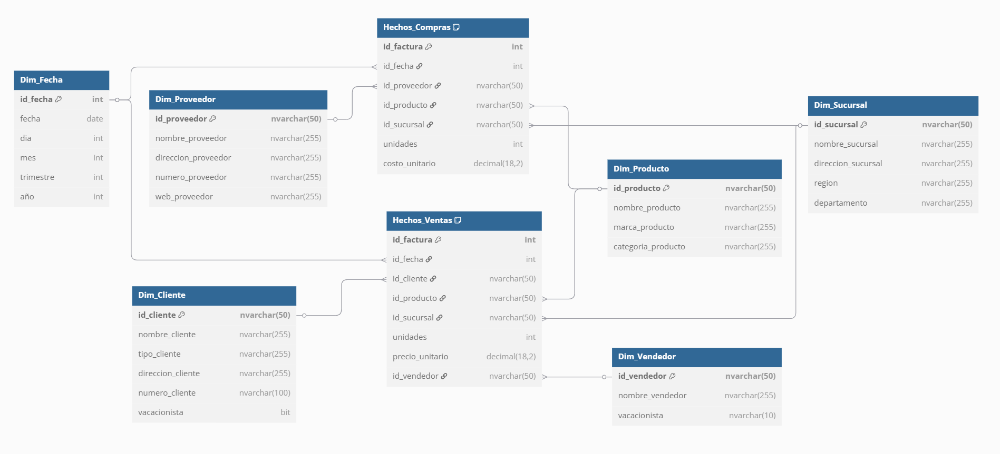

Christian Alessander Blanco González
202000173

### ¿Qué ventajas tiene el modelo estrella?

Este modelo fue elegido porque ofrece varios beneficios muy alineados con los objetivos del proyecto SG-Food:

1. **Simplicidad en el diseño y consulta**  
   Las uniones (JOINs) son directas entre la tabla de hechos y cada dimensión. Eso hace que escribir consultas en SQL (o generar reportes desde Power BI) sea mucho más fácil y eficiente.

2. **Alto rendimiento para BI**  
   Este diseño está optimizadísimo para lecturas rápidas, especialmente cuando se trata de resumir grandes volúmenes de datos (por ejemplo: ventas por producto, sucursal y mes).

3. **Facilidad de uso para usuarios de negocio**  
   Las dimensiones suelen tener nombres legibles y bien organizados, lo que permite que analistas, sin ser expertos técnicos, puedan usar herramientas como Power BI o Excel sin depender del área técnica.

4. **Flexibilidad para reportes**  
   Como SG-Food necesita generar reportes en intervalos flexibles (por ejemplo: ventas semanales, mensuales o por producto), el modelo estrella permite aplicar filtros fácilmente sobre las dimensiones sin complicar la lógica.

5. **Mejor integración con herramientas como SSAS**  
   El modelo estrella es el formato ideal para cubos OLAP y herramientas de Microsoft como SQL Server Analysis Services (SSAS), lo cual lo hace muy compatible con el stack tecnológico requerido.

- Hay tablas de hechos como HechoVentas o HechoCompras, con campos como idProductoDW, idClienteDW, idSucursalDW, etc.
- Y múltiples tablas de dimensiones como:
  - `DimProducto`
  - `DimCliente`
  - `DimFecha`
  - `DimSucursal`
- Todas estas tablas están relacionadas directamente con las tablas de hechos, no entre ellas. 

---

## Transformaciones

- Limpieza de datos al inicio, como sustituyendo valores null por algún valor por defecto.
- Eliminando las comillas en las direcciones y en algunos campos.
- También se eliminaron los espacios en blancos como en Region y Departamento.
- Y se limito el numero del cliente o proveedor para que no sobre pase los 8 digitos.
- Luego se transformaron algunos datos a cadena unicode para la carga a la base de datos, así incluyendo el tipo de fecha como database, y el booleano para lo que sería el campo de vacacionista.